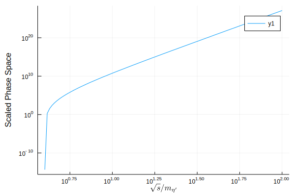

# Examples

```@setup rambo
using Rambo
const me = 0.510998928
const mμ = 105.6583715
const αem = 1.0 / 137.04
const GF = 1.1663787e-11
function msqrd_ee_to_mumu(momenta::Array{FourMomentum{Float64},1})
    # extract the final-state momenta
    p3::FourMomentum{Float64} = momenta[1]
    p4::FourMomentum{Float64} = momenta[2]
    # compute the total momentum and extract the CME
    P::FourMomentum{Float64} = sum(momenta)
    Q::Float64 = P.e
    pmag::Float64 = sqrt(Q^2 / 4 - me^2)
    # choose the initial-state momenta to be along the z-axis
    p1::FourMomentum{Float64} = FourMomentum(Q / 2, 0.0, 0.0, pmag)
    p2::FourMomentum{Float64} = FourMomentum(Q / 2, 0.0, 0.0, -pmag)
    # compute mandelstam variables
    s::Float64 = scalar_product(p1 + p2, p1 + p2)
    t::Float64 = scalar_product(p1 - p3, p1 - p3)
    # matrix element squared
    return ((32π^2 *
             (2me^4 + 2mμ^4 + s^2 + 4me^2 * (mμ^2 - t) - 4mμ^2 * t + 2s * t +
              2t^2) *
             αem^2) / s^2)
end
function msqrd_μ_to_eνν(momenta)
    pe = momenta[1]
    peν = momenta[2]
    pμν = momenta[3]
    pμ = sum(momenta)
    return 64GF^2 * scalar_product(pe, pμν) * scalar_product(pμ, peν)
end
```

## ``e^+e^- \to \mu^+\mu^-``
Here we describe how to compute the cross section for electron/positron annihilation into muons. First, we write a function for computing the matrix element. This function must take in an array of `FourMomentum` and return the squared matrix element. We can write this as:

```julia
using Rambo
const me = 0.510998928; # electron mass
const mμ = 105.6583715; # muon mass
const αem = 1.0 / 137.04; # EM fine structure

function msqrd_ee_to_mumu(momenta::Array{FourMomentum{Float64},1})
    # extract the final-state momenta
    p3::FourMomentum{Float64} = momenta[1]
    p4::FourMomentum{Float64} = momenta[2]
    # compute the total momentum and extract the CME
    P::FourMomentum{Float64} = sum(momenta)
    Q::Float64 = P.e
    pmag::Float64 = sqrt(Q^2 / 4 - me^2)
    # choose the initial-state momenta to be along the z-axis
    p1::FourMomentum{Float64} = FourMomentum(Q / 2, 0.0, 0.0, pmag)
    p2::FourMomentum{Float64} = FourMomentum(Q / 2, 0.0, 0.0, -pmag)
    # compute mandelstam variables
    s::Float64 = scalar_product(p1 + p2, p1 + p2)
    t::Float64 = scalar_product(p1 - p3, p1 - p3)
    # matrix element squared
    return ((32π^2 *
             (2me^4 + 2mμ^4 + s^2 + 4me^2 * (mμ^2 - t) - 4mμ^2 * t + 2s * t +
              2t^2) *
             αem^2) / s^2)
end;
```
To compute the cross section, we need to declare the initial- and final-state particle masses and the center-of-mass energy:

```@repl rambo
isp_masses = [me, me];
fsp_masses = [mμ, mμ];
cme = 1000.0 # 1 GeV;
```

Now we can call `cross_section` to compute the cross section. We use 10000 points and pass in our `msqrd_ee_to_mumu` function for the squared matrix element.

```@repl rambo
rambo = cross_section(
    cme,
    isp_masses,
    fsp_masses;
    nevents = 10000, msqrd = msqrd_ee_to_mumu
)
```

Let's compare out results with the analytical result:

```@repl rambo
analytic = ((4π * sqrt(1 - 4mμ^2 / cme^2) * (2me^2 + cme^2) *
             (2mμ^2 + cme^2) * αem^2) /
            (3 * sqrt(1 - 4me^2 / cme^2) * cme^6))
```

## ``\mu^{\pm}\to e^{\pm}\nu\nu``

Here we give a slightly more realistic case where we might want to use rambo,
but where analytically results still exist. We would like to compute the partial decay width of the muon to and electron and neutrinos. As above, we
first supply a function for the matrix element:

```julia
const GF = 1.1663787e-11; # Fermi-constant

function msqrd_μ_to_eνν(momenta)
    pe = momenta[1]
    peν = momenta[2]
    pμν = momenta[3]
    pμ = sum(momenta)
    return 64GF^2 * scalar_product(pe, pμν) * scalar_product(pμ, peν)
end
```

Next, we tell Rambo what the final-state masses are and what the mass of the
decaying particle is. We can then compute the estimated width using the
`decay_width` function:

```@repl rambo
fsp_masses = [me, 0.0, 0.0]
rambo = decay_width(mμ, fsp_masses; nevents=100000, msqrd=msqrd_μ_to_eνν)
```

Let's compare this result to the analytical result:
```@repl rambo
r = me^2 / mμ^2
analytic = GF^2 * mμ^5 / 192π^3 * (1 - 8r + 8r^3 - r^4 - 12r^2 * log(r))
```

## ``2\eta'\to4\eta'``

As a slightly more complicated (but more practical) example, we consider an SU(N) gauge-theory in the large-N limit with a single quark species. The basics of this theory and more details of this computation are described in this [post](https://loganamorrison.github.io/2019/08/23/thermal-cross-section-2-to-4-eta-prime.html). For our purposes, all we need to know is that, below the confinement scale, this theory contains an ``\eta'`` analog (a ``\bar{q}q`` bound state) which can interact through ``2n``-point interactions (where ``n=1,2,3,\dots``.) Suppose we would like the compute the
phase space integral for ``\eta'\eta'\to\eta'\eta'\eta'\eta'``. This calculation would require use to evaluate the following integral:
```math
\int\prod_{i=1}^{4}\dfrac{d^3q_{i}}{(2\pi)^2 2\epsilon_{i}}
|\tilde{\mathcal{M}}|^2(2\pi)^4\delta^{4}\left(q_{i,1} + q_{i,2} -
\sum_{i=1}^{4}q_{i})\right)
```
Note that here, ``q_{i}, \epsilon_{i}`` and ``\tilde{\mathcal{M}}`` are the final-state particle momenta, energy and the matrix element appropriately rescaled by mass of the ``\eta'`` (this rescaling isn't necessary, but is convenient for this problem.) Clearly this calculation would be quite complicated even without an non-constant matrix element. Thus, `Rambo` is quite useful for this case.  The squared matrix element is complicated (it arises from a term in the Lagrangian that goes like ``(\partial\eta')^6`` or chains of matrix elements of ``(\partial\eta')^4``), but is given by:

```julia
function scaled_msqrd(momenta)
  # Extract the center of mass energy
  Q::Float64 = sum(momenta).e
  # Compute the magnitude of the initial state eta' 3-momentum
  p::Float64 = sqrt(Q^2 / 4 - 1)
  # Chose the initial state eta's to be in the CM frame traveling
  # along z-axis
  q1 = FourMomentum(Q / 2, 0.0, 0.0, p)
  q2 = FourMomentum(Q / 2, 0.0, 0.0, -p)
  # Extract the final state eta' momenta
  q3, q4, q5, q6 = momenta

  return (528 *(
    scalar_product(q1,q4)*scalar_product(q2,q6)*scalar_product(q3,q5) +
    scalar_product(q1,q4)*scalar_product(q2,q5)*scalar_product(q3,q6) +
    scalar_product(q1,q3)*scalar_product(q2,q6)*scalar_product(q4,q5) +
    scalar_product(q1,q2)*scalar_product(q3,q6)*scalar_product(q4,q5) +
    scalar_product(q1,q6)*(scalar_product(q2,q5)*scalar_product(q3,q4) +
    scalar_product(q2,q4)*scalar_product(q3,q5) +
    scalar_product(q2,q3)*scalar_product(q4,q5)) +
    scalar_product(q1,q3)*scalar_product(q2,q5)*scalar_product(q4,q6) +
    scalar_product(q1,q2)*scalar_product(q3,q5)*scalar_product(q4,q6) +
    scalar_product(q1,q5)*(scalar_product(q2,q6)*scalar_product(q3,q4) +
    scalar_product(q2,q4)*scalar_product(q3,q6) +
    scalar_product(q2,q3)*scalar_product(q4,q6)) +
    scalar_product(q1,q4)*scalar_product(q2,q3)*scalar_product(q5,q6) +
    scalar_product(q1,q3)*scalar_product(q2,q4)*scalar_product(q5,q6) +
    scalar_product(q1,q2)*scalar_product(q3,q4)*scalar_product(q5,q6)))^2
end;
```
(this is actually just the squared matrix element stemming from the ``(\partial\eta')^6`` term in the Lagrangian, but is sufficient for demonstration purposes.) To integrate over phase space in `Rambo`, we use the `integrate_phase_space` function. Let's compute the phase space integral for various center of mass energies and plot the results:

```julia
# Pick CM energies from 4mη → 100mη
scaled_cmes = 10 .^ (range(log10(4.0 + 1e-5), stop=log10(100),length=100))
# The scaled masses are all unity
scaled_masses = [1.0, 1.0, 1.0, 1.0];
# Compute the values of the scaled phase-space
ps(cme) = integrate_phase_space(cme, scaled_masses; msqrd=scaled_msqrd)[1]
scaled_ps = [ps(cme) for cme in scaled_cmes]

using Plots;
using LaTeXStrings;

plot(scaled_cmes, scaled_ps, yaxis=:log10, xaxis=:log10)
ylabel!("Scaled Phase Space")
xlabel!(L"$\sqrt{s}/m_{\eta'}$")
```


## Dark Matter Annihilation Spectrum

As a final example, we consider the following. Suppose we have a theory of dark matter (DM) in which the dark matter interacts with the Standard Model (SM) through a new vector mediator. Let the interaction Lagrangian for this theory contain:
```math
\mathcal{L} \supset g_{V\chi}V_{\mu}\bar{\chi}\gamma^{\mu}\chi + g_{V\mu}V_{\mu}\bar{\mu}\gamma^{\mu}\mu
```
Suppose we would like to determine the ``\gamma``-ray spectrum of the process ``\bar{\chi}\chi\to V^{*}\to\mu^{+}\mu^{-}\gamma`` where ``\chi`` is the DM and``V_{\mu}`` is the new vector mediator. That is, we would like to compute
```math
\dfrac{dN}{dE_{\gamma}} = \dfrac{1}{\sigma_{0}}\dfrac{d\sigma}{dE_{\gamma}}
```
where ``\sigma`` is the cross-section for ``\bar{\chi}\chi\to V^{*}\to\mu^{+}\mu^{-}\gamma`` and ``\sigma_{0}`` is the cross-section for ``\bar{\chi}\chi\to V^{*}\to\mu^{+}\mu^{-}``, i.e. the non-radiative cross-section. This calculation can be done analytically. We refer the interested reader to [this paper](https://arxiv.org/abs/1907.11846v2) for more details on this theory. This calcuation can also be done in rambo. 
